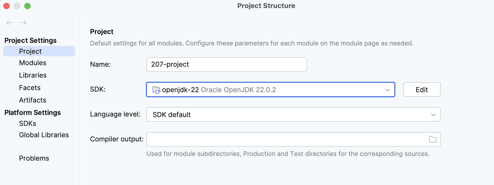

## Java Version
Make sure to use openjdk-22. I think this is the newest version and what we've already been using this semester:

## Making pushes/pull-requests
- First thing to do:

- You can find that link on Quercus. Make sure your school email is associated (it should already be that way)
and make a small pull request from a new branch to make sure you show up in the graph. You can just slightly edit this
README or add a comment somewhere or something.
- Settings are such that each pull request just requires one reviewer. 
- Everytime you're working on a new feature/usecase, you should create a new branch for it. It would be easier if right when we create
our branches, we make a push to github so the others know what we're working on.
- Also before pushing your final copy of the branch to github and opening a pull request,
make sure to pull the most recent version of the main branch (into your local main branch) and merge
that into your feature branch. Then you can deal with the conflicts (if there are any) before
trying the pull request.
## Style 

- While you're coding and following the structure of the starter code
(it's just the code we already did for lab 5, slightly modified), keep this picture in
mind:
  

- Try to follow SOLID and clean architecture (can refactor at the end). If you follow the stuff
from the starter code, that should be like 95% good.
- Try to write JDocs (can be stupidly basic) and tests for your stuff as you go.
- Try to keep stuff as private as possible (always make instance variables private
with getters/setters if needed.)
- Make helper methods private.
- I'm not sure if they care about checkstyle but if so, we can just use the
configurations from the mystyle.xml file.

## John/database stuff 
There are three DAOs in package `data_access`! All three implement the Data Access Interface
from the use cases. The Use Case code works with any of them.

* Class `FileUserDataAccessObject` manages data storage and retrieval in a
  CSV file, and also keeps the data in a `Map` for easier access. This temporary storage
  is called a *cache* of the information in the file.

* Class `DBUserDataAccessObject` uses okhttp to use an API, working with JSON data. Your team
  might want to refer to this when you do your API work. This API is similar to the one from the third lab;
  you can read its documentation
  [here](https://www.postman.com/cloudy-astronaut-813156/csc207-grade-apis-demo/documentation/fg3zkjm/5-password-protected-user).

- For the database stuff, John will have to use one of the above two options (or something else that's easy to integrate but these 2 have examples
in labs 3,4 and 5 and are already designed to fit with the structure of the starter code (the lab 5 solo part might be especially useful, but keep in mind
that the stuff for task 2 (editing login use case) is already implemented). You could also look at what's done for "minimal note application" 
on Quercus, under "project repository and sample starter code") 
- Until then, we can hook up our code to
  `InMemoryDataAccessObject` to make sure stuff works and start programming (also use this one for all tests).

* Class `InMemoryDataAccessObject` **doesn't save the user data to any kind of file at all**,
  and is intended to be used by the unit tests.
    * It's also simple to write, which means that you can start
      programming your Use Cases before you even have the details of data persistence worked out.
- At the end, we should delete anything in the `data_access`! package we don't use.